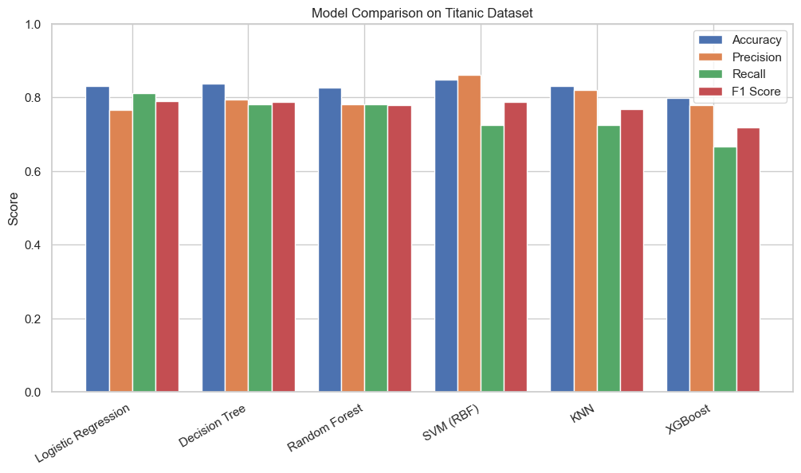

# Titanic - Machine Learning Project 🚢  

An end-to-end machine learning project on the famous *Titanic dataset* from Kaggle.  
This repository demonstrates the full workflow of a data science project: from *data preprocessing and feature engineering* to *training, evaluating, and comparing multiple machine learning models*.  

---

## 📌 Project Overview  

The Titanic dataset is a classic problem in machine learning: predicting whether a passenger survived the Titanic shipwreck based on demographic and socio-economic factors.  
This project covers:  
- Data cleaning and handling missing values  
- Feature engineering (e.g., titles from names, family size)  
- Encoding categorical variables  
- Train/test split and scaling  
- Training multiple ML models  
- Evaluating model performance with accuracy, precision, recall, and F1-score  
- Model comparison with visualization  

---

## 📊 Dataset  

The dataset comes from the *Kaggle Titanic - Machine Learning from Disaster* competition:  
- *train.csv* → used for model training & validation  
- *test.csv* → used for final prediction (submission file not included here)  

🔗 [Kaggle Competition Page](https://www.kaggle.com/c/titanic)  

---

## 🛠 Technologies & Libraries  

- Python 3.x  
- Pandas, NumPy  
- Matplotlib, Seaborn  
- Scikit-learn  
- XGBoost  

All dependencies are listed in *requirements.txt*.  

---

## 🚀 Models Implemented  

1. Logistic Regression  
2. Decision Tree Classifier  
3. Random Forest Classifier  
4. Support Vector Machine (SVM)  
5. K-Nearest Neighbors (KNN)  
6. XGBoost Classifier  

---

## 📈 Results & Insights  

- *Random Forest* and *SVM* achieved the best balance between accuracy and F1-score.  
- Feature importance analysis highlighted *Sex, **Pclass, and **Fare* as the most influential predictors.  
- Data preprocessing (scaling, encoding, feature engineering) significantly improved model performance.  

A visualization comparing all models:  

  

---

## 🔮 Future Work  

- Hyperparameter tuning with GridSearchCV / RandomizedSearchCV  
- Ensemble stacking for improved performance  
- Adding external features (e.g., family connections, cabin info)  
- Deployment with Flask/FastAPI  

---

## 🙌 Acknowledgments  

- Kaggle for providing the Titanic dataset  
- Scikit-learn & XGBoost for machine learning tools  
- Matplotlib & Seaborn for visualization  

---

## 👨‍💻 Author  

Created with ❤ by *Arshia Estineh*  
📧 Email: Arshiaestineh2005@icloud.com  
🔗 GitHub: [arshiaestineh2563](https://github.com/arshiaestineh2563)